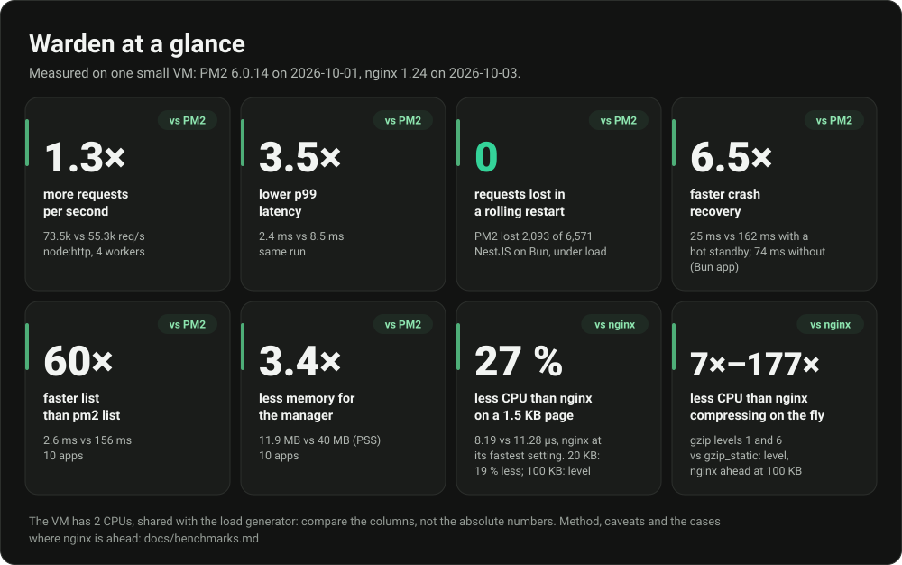
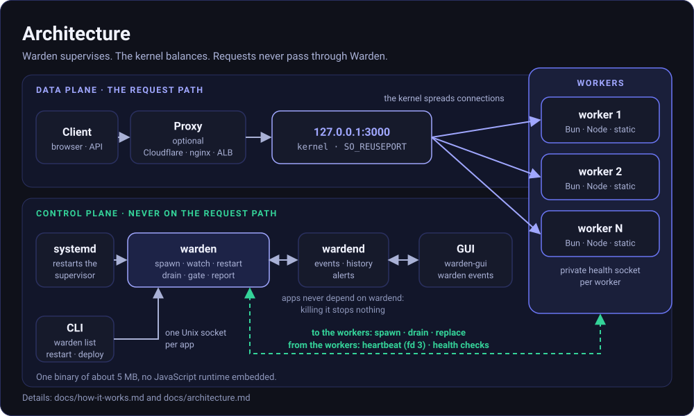
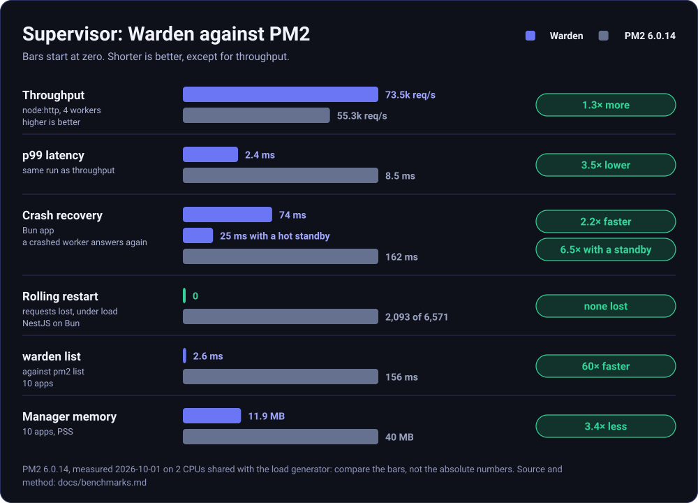
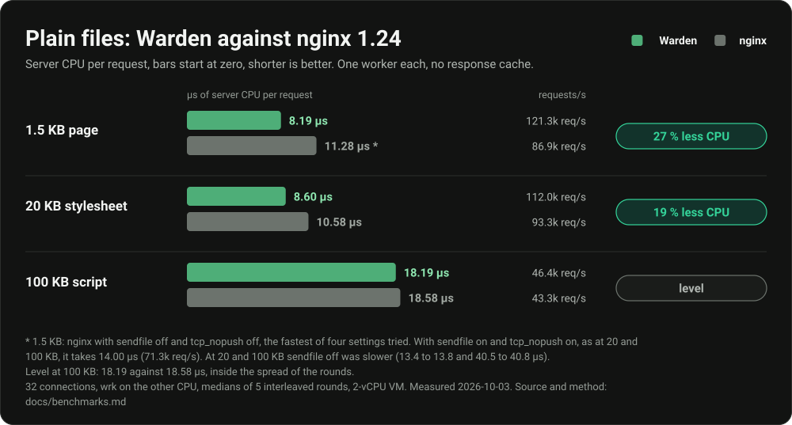
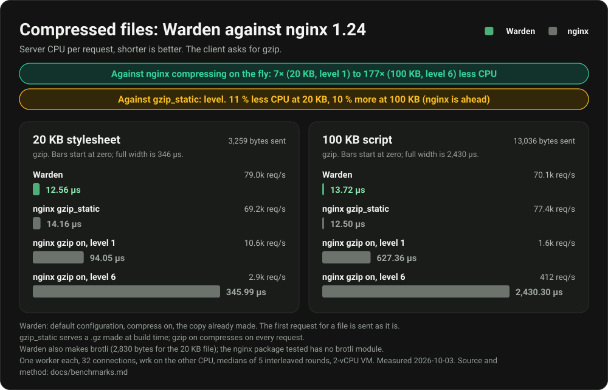
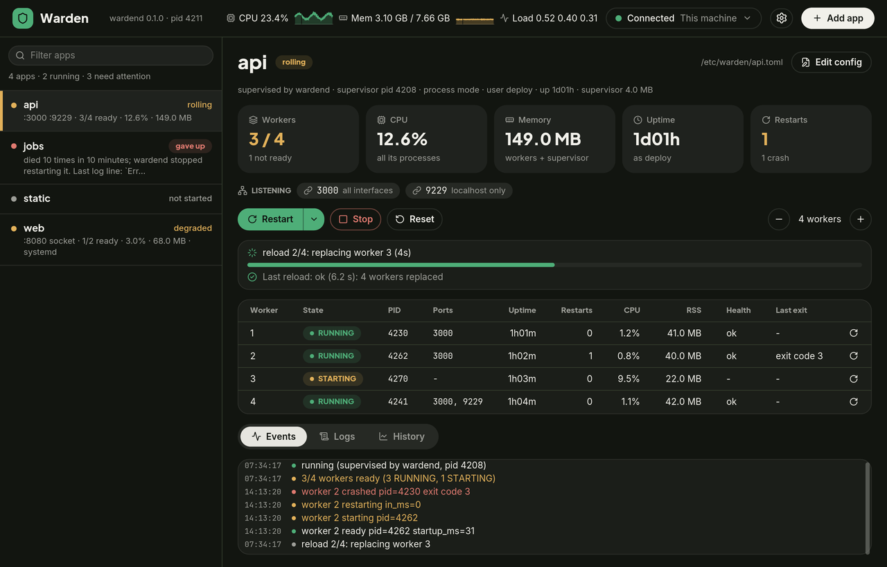
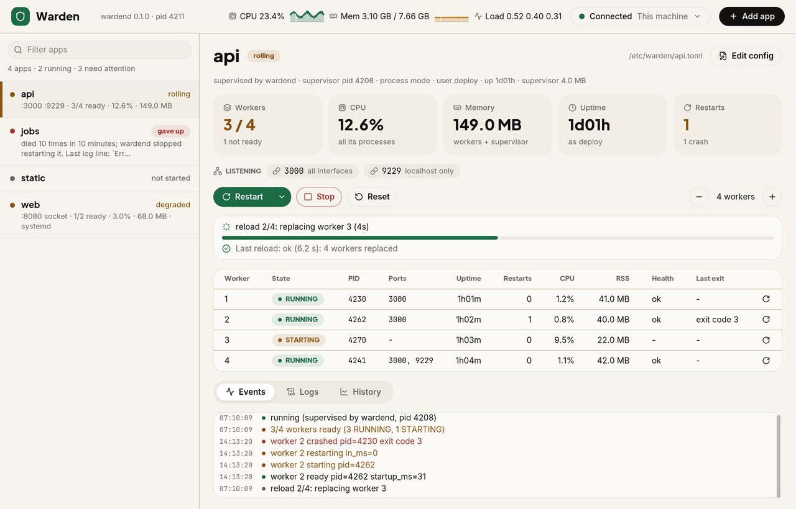
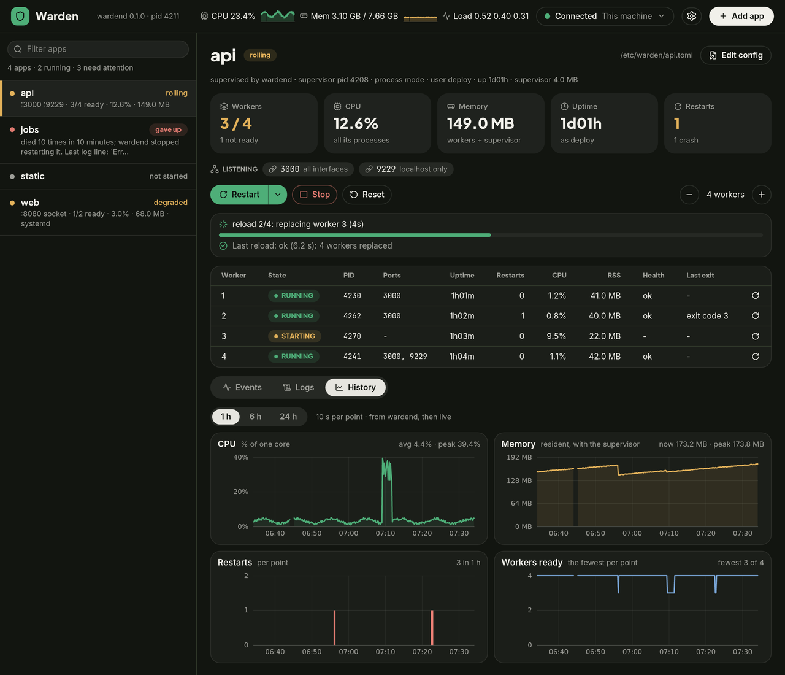
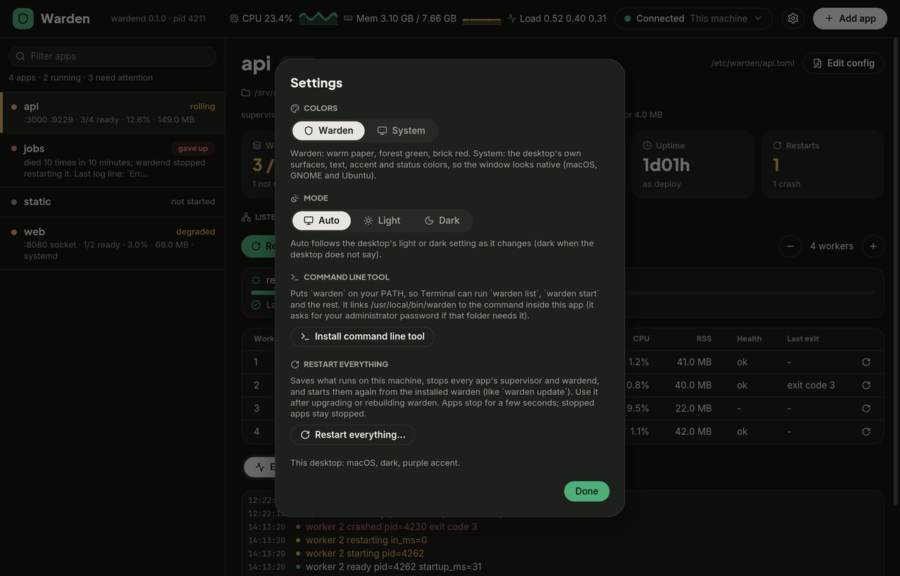
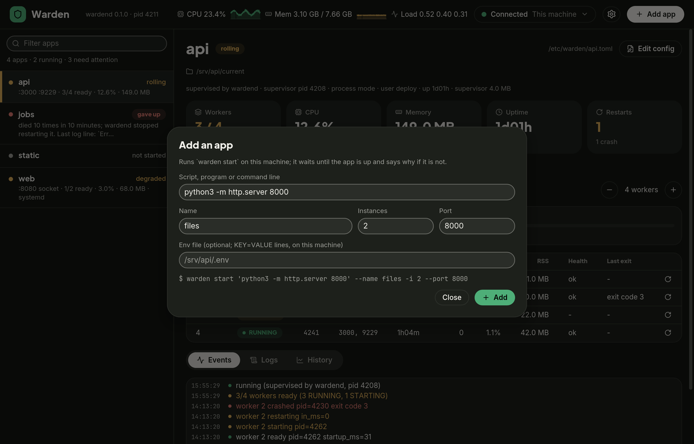

<p align="center"></p>

<h1 align="center">Warden</h1>

<p align="center"><b>A fast, crash-safe supervisor for Bun and Node apps.</b><br>
N copies of your HTTP app on one machine, a PM2-like CLI, zero-downtime deploys.</p>

<p align="center"><a href="#install">Install</a> · <a href="#quick-start">Quick start</a> · <a href="#benchmarks">Benchmarks</a> · <a href="#documentation">Docs</a></p>



## Why Warden

| | |
|---|---|
| **Not on the request path** | The kernel spreads connections over the workers (`SO_REUSEPORT`). Warden only supervises them. |
| **PM2's commands** | `warden start`, `list`, `logs`, `restart`, `save`, `startup`; `warden pm2-migrate` imports your apps. |
| **Zero-downtime deploys** | New workers pass health checks before old ones drain. A canary and automatic rollback guard every deploy; WebSockets and SSE streams end cleanly. |
| **Static files built in** | `warden serve dist 8080`, supervised like any app, with gzip and brotli copies made in the background. |
| **A GUI** | A native window with live state, logs and charts for every app on a host, or on a remote one over SSH. |
| **One small binary** | Rust, about 5 MB, no JavaScript runtime embedded. |

## Architecture



Warden spawns, watches and replaces the workers; the kernel balances connections between them, so a request never passes through Warden. wardend, the host daemon behind `warden events` and the GUI, is always on and never needed by the apps ([docs/wardend.md](docs/wardend.md)); the design in short: [docs/how-it-works.md](docs/how-it-works.md).

## Install

```sh
curl -fsSL https://raw.githubusercontent.com/oceanwap/warden/main/install.sh | sh
```

This puts `warden` in `/usr/local/bin` (as root) or `~/.local/bin`, after checking the download against the release's `SHA256SUMS`. Options go after `sh -s --` (`... | sh -s -- --gui`): `--gui` also installs the GUI (`install-gui.sh`, or `warden gui-install` later, does only that), `--version v0.2.0` picks a release, `--uninstall` removes it. Linux and macOS, x86_64 and arm64.

Also: `.deb` and `.rpm` packages for Debian, Ubuntu, Fedora and RHEL ([docs/packages.md](docs/packages.md)), and a `.dmg` with the GUI and the CLI for macOS. Downloading the archives by hand and every installer detail: [docs/install.md](docs/install.md). Linux is the production platform; macOS is for development, and Windows works through WSL2 ([docs/platforms.md](docs/platforms.md)).

<details>
<summary>From source</summary>

Needs Rust; Warden is not on crates.io. It is also the way to run the latest `main` when no release has been published yet.

```sh
git clone https://github.com/oceanwap/warden.git && cd warden
cargo build --release          # target/release/warden
cargo install --path .         # or: put it in ~/.cargo/bin
```

</details>

## Quick start

Your app only has to listen on `process.env.PORT`.

```sh
warden start server.js --name api -i 4 --port 3000   # 4 workers; waits until the app is up
warden list                                          # every app and worker, with ids
warden logs api                                      # recent lines, then follow
warden restart api                                   # replace workers one at a time, no downtime
warden reload api                                    # the same, re-reading the config first
warden deploy api                                    # safest: preflight, canary, then the rest, with rollback
warden stop api
```

An app with a config file: `warden start -c warden.toml` (see [Configuration](#configuration)). `warden doctor` checks the host for problems Warden knows about, with a fix for each.

Bring the apps back after a reboot or a crash:

```sh
warden save                    # remember the running apps and their worker counts
warden startup                 # systemd units (sudo for system units) or a launchd job on macOS
warden resurrect               # start what `save` remembered
```

After upgrading the binary, `warden update` moves every supervisor and wardend to it; the apps keep serving. Every command and option: [docs/commands.md](docs/commands.md).

## Benchmarks

One small VM with 2 CPUs, shared with the load generator: compare the bars, not the absolute numbers. PM2 6.0.14 was measured on 2026-10-01, nginx 1.24 on 2026-10-03.

### Supervisor against PM2



- **Better:** Warden adds nothing to the request path, so 4 workers of `node:http` do 73.5k req/s, level with the same processes run bare (66.9k, within this machine's noise). PM2's cluster mode passes every connection through its daemon: 55.3k req/s, p99 8.5 ms against 2.4 ms.
- **Better:** a rolling restart lost no request. PM2's `reload` is graceful only for Node in cluster mode; a Bun app runs in fork mode, where it is a restart, and NestJS on Bun lost 2,093 of 6,571 requests. WebSockets and SSE streams end cleanly under Warden (0 abnormal closes of 100 per runtime); under PM2 every one was cut.
- **Costs:** a hot standby is one idle worker (+13 MB PSS for `node:http`, +44 MB for NestJS on Bun). The requests in flight on a crashed worker are lost under every manager, Warden's included.

### Plain files against nginx



- **Better:** 27 % less CPU per request on a 1.5 KB page (nginx at the fastest of four settings tried) and 19 % less on a 20 KB stylesheet (nginx with `sendfile on`, its fastest setting there): 121k and 112k req/s against 87k and 93k.
- **Level:** at 100 KB, 18.19 against 18.58 µs, inside the spread of the rounds (same nginx setting as at 20 KB).
- **Costs:** none that this run shows. It measures kept-alive connections only, and neither side caches files: Warden's response cache is off by default, and the nginx here has no `open_file_cache`.

### Compressed files against nginx



- **Better:** against nginx compressing on the fly, 7× (20 KB, level 1) to 177× (100 KB, level 6) less CPU. Warden compresses once, in the background, at the lowest priority, and a request never waits for it.
- **Level:** against `gzip_static`, a `.gz` you make at build time: 11 % less CPU at 20 KB, 10 % more at 100 KB, where nginx is ahead and has the better p99 (0.84 against 2.19 ms).
- **Costs:** the first request for a file, and the first after it changes, is sent uncompressed and queues the compression. A compressed answer takes about 4 µs more CPU than a plain one (12.56 against 8.60 µs for the 20 KB stylesheet), as it opens the copy as well. Copies need a private folder (`compress_dir`) and some CPU at low priority.
- Warden also makes brotli copies (2,830 bytes for the 20 KB file, 3,259 for gzip); the nginx package tested has no brotli module.

Every number, the method and the caveats, including the one synthetic file per size on a noisy VM: [docs/benchmarks.md](docs/benchmarks.md#static-files-against-nginx-plain-and-compressed-2026-10-03) and [bench/README.md](bench/README.md). `cargo xtask bench` re-runs the suites in the repository.

## Several apps on one server

Each app serves its own TLS and HTTP/2, so nothing needs to sit in front of it. **Putting nginx in front slows the server down:** decrypting and re-sending every request cost 3–7× the CPU of the app answering alone, and cut throughput to 13–34 % of it (table below). Fastest first:

1. **One address per app.** Point each hostname at its own IP (an IPv6 /64 gives you plenty) and have each app listen on its address at port 443. The kernel picks the app by address, so there is no layer at all, the same as `direct` below. Set `[app] address = "2001:db8::10"` and Warden adds the address and binds the app to it. IPv4 visitors need a spare IPv4 per app; otherwise send them through the router (2), which works alongside.
2. **One address, Warden's hostname router.** `[route]` on 443 reads the hostname from the TLS hello and hands the connection itself to the app's worker, which then talks to the visitor directly and sees their real IP. Needs a Bun with `server.adopt` (oven-sh/bun#44768) or Node's `node:http`/`node:https`: 93–96 % of direct.
3. **The same router, copying bytes.** On stock Bun the router passes the bytes instead, with the visitor's IP kept: 45–70 % of direct, level with nginx's own pass-through (`stream` + `ssl_preread`).

One Bun.serve app, 2 workers on 2 CPUs, h2load on 2 others, median of 3 rounds (2026-10-08). Requests/s, with the server CPU per request in brackets:

| | HTTP/2, 12 B | HTTP/2, 64 KB | HTTP/1.1, 12 B |
|---|---|---|---|
| Direct (nothing in front) | 258,409 (7.7 µs) | 26,763 (74 µs) | 108,697 (17.5 µs) |
| **Warden router, hand-off** | **245,265 (8.1 µs)** | **25,595 (78 µs)** | **100,700 (18.6 µs)** |
| Warden router, copying | 140,719 (13.8 µs) | 18,634 (106 µs) | 48,945 (40.2 µs) |
| nginx pass-through (`stream`) | 148,545 (13.2 µs) | 17,145 (114 µs) | 48,667 (40.2 µs) |
| nginx in front (`proxy_pass`) | 34,881 (57.2 µs) | 9,041 (220 µs) | 27,457 (72.6 µs) |

Bun 1.4.3 with `server.adopt`, nginx 1.31.6 with as many workers as the app. Run it yourself: `bun bench/routing.ts --bun <bun> --nginx <nginx>` ([bench/README.md](bench/README.md)). Setup: [docs/routing.md](docs/routing.md).

## Static files

`warden serve dist 8080` runs Warden's own file server as the app's workers: supervised, health-checked and reloaded like any app.

- **Serves** ETag and 304s, single ranges, SPA fallback, `404.html` and Basic auth.
- **Compresses in the background**, on by default. The first request for a file is answered as it is and queues the work; the next ones get a brotli or gzip copy. The copies live in a private folder of their own (`compress_dir`), never in the folder you serve, and a changed file never gets an old copy.
- **Uses your copies too:** a `file.br` or `file.gz` made by your build is sent when Warden has made none.
- **Caches nothing by default**, like nginx: the OS page cache does it. An opt-in response cache (`cache_size`) keeps small files in memory.
- **Counts its responses** by status (404s too), shown in `warden list` and the GUI, as it does for Node apps through Node's own diagnostics channel.
- `compress = false` turns the background compression off. Every `[static]` key: [docs/static-serving.md](docs/static-serving.md).

## Coming from PM2

- `warden` in place of `pm2` covers `start`, `list`, `logs`, `flush`, `stop`, `delete`, `save`, `resurrect`, `startup`, `update` and `serve`, and `monit` as `top` and `events`.
- Two differ on purpose: `warden restart` and `warden reload` replace workers one at a time through health gates and roll back on failure; PM2's plain `restart` is `warden restart --hard`.

To move your running apps:

```sh
warden pm2-migrate --dry-run                   # what it would write, from `pm2 jlist`
warden pm2-migrate                             # <app>.toml + <app>.env (0600) + MIGRATION.md
warden pm2-migrate --cutover same-port         # PM2 stops each app, Warden starts it; PM2 is restored on failure
warden pm2-migrate --finalize                  # remove the migrated apps from PM2, `warden save`
```

Env values go to a 0600 file, never into the config. The command-by-command differences, and what `pm2-migrate` carries over: [docs/comparison.md](docs/comparison.md). Coming from wattpm? `warden migrate-wattpm` converts a Platformatic Watt project and lists what has no equivalent: [docs/wattpm.md](docs/wattpm.md).

## Configuration

One TOML file per app. A minimal one (everything else has a default):

```toml
[app]
name = "api"
command = "bun"
args = ["run", "dist/main.js"]
working_directory = "/srv/apps/api/current"
port = 3000

[workers]
count = 4

[health]
enabled = true
path = "/health"          # checked on each worker's private socket
```

`warden check -c warden.toml` validates it. Every key, with its default: [docs/configuration.md](docs/configuration.md); an annotated file to copy: [warden.example.toml](warden.example.toml).

## GUI



<table>
  <tr>
    <td><br><sub>Light mode, or follow the desktop</sub></td>
    <td><br><sub>1, 6 or 24 hour charts per app</sub></td>
  </tr>
  <tr>
    <td><br><sub>Settings: Warden or the desktop's own colors</sub></td>
    <td><br><sub>Add an app, or edit its config</sub></td>
  </tr>
</table>

`warden-gui` is a native window on wardend: live state, workers, CPU and memory of every app, logs, events and charts, and the CLI's actions, adding an app and editing its config. `warden-gui --ssh deploy@web-1` connects to a remote host. It is a separate process: closing it touches nothing. See [gui/README.md](gui/README.md).

## Documentation

| | |
|---|---|
| **Get started** | [Install](docs/install.md) · [Linux packages](docs/packages.md) · [Platforms](docs/platforms.md) · [Windows](docs/windows.md) · [Commands](docs/commands.md) · [Configuration](docs/configuration.md) |
| **Run it in production** | [Deploying without downtime](docs/deploys.md) · [Staying up](docs/reliability.md) · [Production setup](docs/production.md) · [Behind a proxy](docs/proxies.md) · [File watching](docs/watch.md) · [Troubleshooting](docs/troubleshooting.md) |
| **Parts** | [wardend](docs/wardend.md) · [Static serving](docs/static-serving.md) · [Hostname router](docs/routing.md) · [GUI](gui/README.md) |
| **Coming from** | [Compared with PM2](docs/comparison.md) · [Coming from wattpm](docs/wattpm.md) |
| **Design and numbers** | [How it works](docs/how-it-works.md) · [Architecture](docs/architecture.md) · [Protocol](docs/protocol.md) · [Benchmarks](docs/benchmarks.md) |
| **The project** | [Development](docs/development.md) · [Releasing](docs/releasing.md) · [Review process](docs/review-process.md) · [Chaos soak](docs/chaos.md) · [Changelog](CHANGELOG.md) |

## Contributing and license

Contributions are welcome: see [CONTRIBUTING.md](CONTRIBUTING.md), and
[SECURITY.md](SECURITY.md) for reporting a vulnerability.

Warden is open source, under the [MIT License](LICENSE-MIT) or the
[Apache License 2.0](LICENSE-APACHE), at your option: use it, change it and
ship it, commercially too. Contributions are accepted under the same terms.
Release archives list the licenses of the third-party crates compiled in
(`THIRD-PARTY-LICENSES.txt`; `about.toml` keeps that list to permissive
licenses).
The GUI embeds Inter, Plus Jakarta Sans and JetBrains Mono (OFL) and Lucide
icons (ISC); their licenses ship as `FONT-LICENSES.txt` in the macOS app, the
Linux GUI archive and the `.deb`/`.rpm`.
