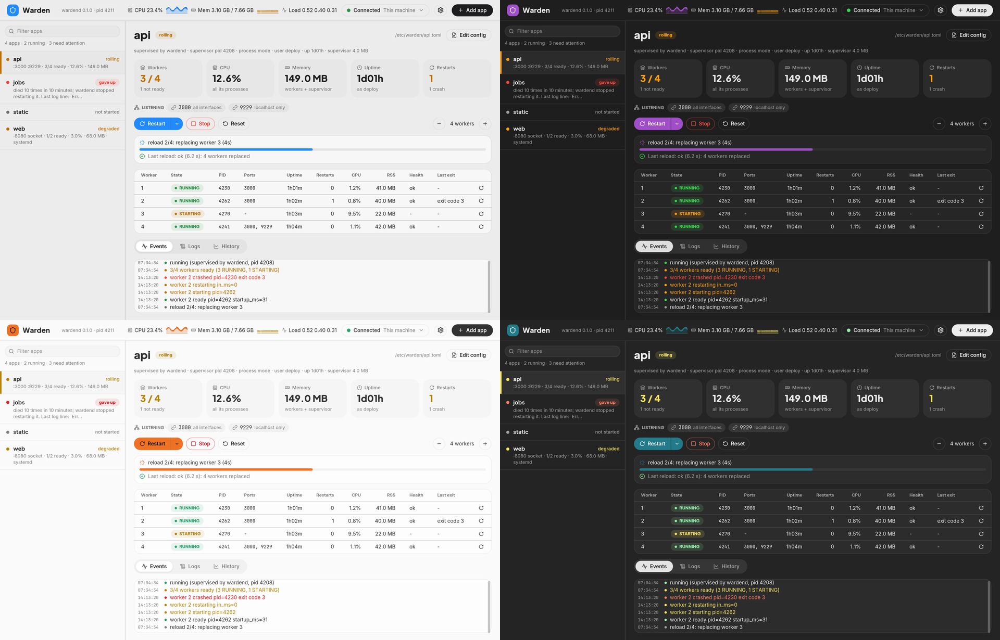

# warden-gui

A native window on [wardend](../README.md#wardend-one-socket-for-every-app):
every app on a host and its live monitoring, and the CLI's actions, in one
place. Rust and [iced](https://iced.rs) 0.14, drawn on the CPU (tiny-skia):
one ~8 MB binary, no web view, no GPU driver.


## What it does

- **Connection bar**: wardend's version and pid, the host's CPU, memory and
  load (from `host` events), with sparklines of the last hour of CPU and of
  memory (out of the total). When wardend is not running it says so, why it
  matters, and offers **Start wardend** (`warden daemon --background`, with
  the `warden` next to the GUI, else the one on PATH). It reconnects by
  itself, with backoff (0.25 s up to 5 s), and says `reconnecting…` meanwhile.
- **App list**: each app's state, who supervises it, workers ready /
  configured, CPU and resident memory (workers, the Bun host in worker mode,
  the supervisor), and its problem with the fix (`AppEntry.problem`). Live
  from `apps` and `status` events.
- **App detail**: the workers table (id, state, pid, uptime, restarts, CPU,
  RSS, health, last exit, and a per-worker restart), the rollout in progress
  with a progress bar (`rollout` / `rollout_done`), the last rollout's
  outcome, and the app's events as `warden events` prints them (the last 500).
- **Actions**, each a request to wardend (`{"cmd":"app",…}`): reload, safe
  reload, rolling restart, hard restart, restart one worker, scale − / +,
  stop, start (wardend's `start` when the supervisor is not running, which
  also clears `gave_up`), reset. Stop, hard restart and scaling to 0 ask
  first. The supervisor's answer shows as a toast; a failure says what
  failed and how to fix it.
- **Logs**: the app's recent lines, then live ones (`subscribe` with
  `logs: true` for that app only), kept in a ring of 2,000 lines, with pause,
  a filter, and stdout / stderr / events toggles. A flood never freezes the
  window: lines are handed over in batches at most 20 times a second, a batch
  keeps the newest 2,000 lines, and every gap shows as "… N lines skipped",
  as `warden logs -f` does.
- **History** (a tab next to Events and Logs): the app's last 1 h, 6 h or
  24 h in four charts: CPU (% of one core, mean per point), memory (resident,
  with the supervisor, max per point), restarts (per point) and workers ready
  (the fewest per point), each with its average, peak or total. A point is
  10 s, 1 min or 4 min (360 per chart). The series come from wardend's
  `history` request (wardend keeps them on disk across its own restarts)
  when the tab opens (or the app or range changes, or the
  connection comes back), then grow live from the statuses already
  streaming, counted the way wardend counts them. Gaps (wardend was not
  running, the app was not watched) stay gaps. Hovering a chart shows a
  crosshair with the value and the time. An older wardend without history
  is named as the reason.

  
- **Add app**: script, program or command line, name, instances, port, and
  an optional env file. It runs `warden start <what> --name <name> -i <n>
  --port <port>` (the exact command is shown) and shows what it printed. The
  env file's variables go into the new supervisor's environment, never onto
  a command line or into the config, and `env_file = "<path>"` is then added
  to the config so restarts from it keep them.
- **Edit config**: the app's TOML (`AppEntry.config`) in an editor.
  **Validate** runs `warden check -c` on the text (a temporary file beside the
  config, so relative paths resolve the same) and shows its error; **Save**
  validates, then writes the file (mode and owner kept); **Reload now** follows.
- **Remote host**: see below.

It is a separate process and only a client: closing or killing it touches no
app, and it never talks to a supervisor directly.

## Look

Soft and rounded: pages with cards on them, pill-shaped controls and a heavy
rounded face for the headings. The colors are Warden's own (warm paper, forest
green, brick red, amber) until you choose the desktop's: the gear in the top bar
opens **Settings**:

- **Colors**: *Warden* (the default) or *System*. System takes the desktop's own
  surfaces, text, accent and status colors, so the window looks native, on
  **macOS** and **GNOME / Ubuntu**: the accent you chose there (macOS: System
  Settings → Appearance → Accent color; GNOME 47 and Ubuntu 24.10: Settings →
  Appearance → Accent color; older Ubuntu: the Yaru theme's color), Apple's
  system colors or libadwaita's. The accent fills every button and bar, so it is
  mixed a little with the window's own surface color (a fifth on a dark window,
  a seventh on a light one): the same hue you chose, sitting in the window
  instead of shouting from it. A color that would be hard to read is moved only
  as far as it needs. On KDE, Xfce and the rest there is nothing to follow, and
  the choice keeps Warden's colors.
- **Mode**: *Auto* (the default), *Light* or *Dark*. Auto follows the desktop's
  light or dark setting, **live** (a change shows as it happens), and is dark
  when the desktop does not say.
- The choice is kept in `gui.json` (next to the SSH machines) and is the same on
  every machine the window connects to. Settings also says what it found:
  *This desktop: macOS, dark, purple accent.*
- `--theme system|warden|light|dark` (or `WARDEN_GUI_THEME`; the flag wins) sets
  it for one run: `system` is System colors with Auto; `warden` is Warden colors
  with Auto; `light` and `dark` are Warden colors in that mode.




How it reads the desktop (only when the window follows it): `defaults read -g
AppleInterfaceStyle` and `AppleAccentColor` on macOS; `gsettings` (`color-scheme`,
`accent-color`, `gtk-theme`) on GNOME and Ubuntu, and `gsettings monitor` to hear a
change at once. It asks again when the window is focused and when iced reports a
change of mode: a few small programs run off the UI thread; no library for a
desktop, no unsafe code.

In every look:

- Color means status and nothing else: the dot, the state label and a faint
  wash of a pill. The app list is flat rows with hairlines between them, and
  the app that is shown has a veil over its row and a thick bar at its left
  edge in its status color (the dot's); every row's content starts at the
  same place, with or without the bar.
- Boxes are see-through (a white veil over the page), so the page shows a
  little through cards and tiles.
- Type: Plus Jakarta Sans for headings and figures, Inter for text,
  JetBrains Mono for pids, ports and logs, and the Lucide icons, all embedded
  as subsets (about 310 KB). Their licenses (OFL for the fonts, ISC for the
  icons) are in `assets/fonts/LICENSES.txt`, shipped as `FONT-LICENSES.txt`
  in the tarball and the `.app`; `assets/fonts/build.py` rebuilds the subsets.
- The window is laid out for 900 × 560 and up: the stat tiles wrap to two
  rows under 1100 px, the worker table scrolls sideways under about 1240 px,
  and when the window is too short for the events, logs or charts to keep a
  usable height the page scrolls instead of squeezing them.


## Run it

```sh
warden-gui                                    # this machine's wardend
warden-gui --socket /run/warden/wardend.sock  # a given socket (root's wardend)
warden-gui --ssh deploy@web-1                 # a remote host (below)
warden-gui --warden ~/src/warden/target/release/warden   # the CLI to run here
warden-gui --theme system                     # the desktop's colors, for this run (or: Settings)
```

Start wardend, Add app and Edit config run the `warden` CLI: `--warden`,
else the one next to `warden-gui` (the GUI + CLI download, `Warden.app`),
else the one on PATH.

From a checkout: `cargo run -p warden-gui` (it finds `target/debug/warden`
next to itself for Start wardend, Add app and Edit config).

On Linux it needs a desktop session (Wayland or X11) and loads
`libxkbcommon` plus `libwayland-client` or the usual X11 libraries at run
time; it links nothing but glibc. macOS: `Warden.app` holds both `warden-gui`
and `warden`.

## A remote host over SSH

wardend has no TCP listener, so there is nothing to expose: the GUI runs

```sh
ssh -N -T -o BatchMode=yes -o ExitOnForwardFailure=yes -o StreamLocalBindUnlink=yes \
    -L <private local socket>:<remote wardend.sock> -- user@host
```

and speaks to wardend through the local end (OpenSSH forwards Unix sockets).
The local socket lives in a directory only you can open
(`$XDG_RUNTIME_DIR/warden-gui-<uid>/`, mode 0700). Set it with **Connection…**
or on the command line:

```sh
warden-gui --ssh deploy@web-1                                           # root's wardend: /run/warden/wardend.sock
warden-gui --ssh deploy@web-1 --remote-socket /run/user/1000/warden/wardend.sock   # a user's wardend
warden-gui --ssh deploy@web-1 --remote-warden '~/.local/bin/warden'   # for Add app, Edit config
```

- No password ever goes through the GUI: ssh runs with `BatchMode=yes` and
  uses your agent and keys (`ssh-add`), your `~/.ssh/config` (aliases, ports,
  jump hosts) and `known_hosts`. Connect once with `ssh user@host` in a
  terminal to accept a new host key.
- The remote sshd must forward Unix sockets: `AllowStreamLocalForwarding yes`
  (the default) for your user, and neither `AllowTcpForwarding no` nor
  `DisableForwarding yes`, which stop socket forwarding too. sshd answers a
  forward it does not allow like a socket nobody listens on, so the GUI's
  "nothing answers" error names both.
- When ssh fails, its own message is shown, with the usual fix: key not
  loaded or refused, an unknown host key, a changed host key (with the
  `ssh-keygen -R` line ssh prints, and the warning not to connect if the
  change is unexpected), an unknown name, a host that does not answer,
  wardend not running there, `warden` not found there.
- The connection is retried with backoff (up to every 5 s), except after a
  refused login or a host key problem, which only you can fix: then every
  10 minutes, so the server's auth log and tools like fail2ban are not
  flooded. **Connection…** → **Connect** tries again at once.
- Add app, Edit config and Start wardend run `warden` on the remote host
  through `ssh user@host '<command>'`, every argument quoted for its shell
  (a POSIX shell: sh, bash, zsh). ssh runs them without your login profile,
  so a `warden` in `~/.local/bin` may not be on their PATH: give its path
  with `--remote-warden` (or in Connection…). An env file for Add app must be
  on this machine; on a remote host add `env_file` with Edit config.
- The tunnel is dropped with the connection (its ssh is killed and the local
  socket removed), and re-opened (with backoff) if ssh exits or is killed;
  the window says which.

## How it works

- `client.rs` keeps **one** `subscribe` connection to wardend
  (`interval_ms: 1000`) for the whole window. A tokio task of its own reads
  it continuously and hands the UI one batch per 50 ms at most, with each
  app's newest status and the newest host metrics only. When the window is
  behind, the batch keeps growing up to its bounds (2,000 log lines, 5,000
  events; the rest is counted as skipped) instead of the reader waiting, so
  wardend never waits for the GUI and never has to disconnect it. While the Logs tab shows an app, a second
  `subscribe` with `logs: true, apps: [<app>]` runs for it (a filter on the
  main stream would also filter out the other apps' statuses). Actions are
  one short connection each.
- Socket I/O and subprocesses run on the tokio executor, never on the UI
  thread. The UI redraws when something arrives (about once a second, the
  status cadence), never in a loop.
- The wire types come from the `warden-protocol` crate (`../protocol`), which
  `warden` itself uses: the two cannot drift. The GUI does not depend on the
  `warden` crate.
- Long lists (events, logs) draw only the rows in view.
- Charts are drawn on iced's `canvas` (tiny-skia paths, real text for the
  labels). Each keeps its drawing in a `canvas::Cache` and draws again only
  when a point moves by half a pixel or more (a fingerprint of the
  positions); the crosshair is a layer of its own. They hold one app's 5
  series and the host's 2, of 360 points each: a few tens of KB whatever
  the range.

## Memory and CPU

Measured on Linux x86_64 (Xvfb, 1280×820 window), release build, connected
to a wardend watching 10 apps (2 workers each), the first app's events
shown, after 15 s, then 60 s idle:

| Build | RSS | PSS | Private | Threads | Idle CPU |
|---|---|---|---|---|---|
| default (tiny-skia, CPU) | 20.7 MB | 16.3 MB | 13.8 MB | 4 | 0.14% |
| `--features wgpu` (GPU renderer; here Mesa's llvmpipe through OpenGL, no GPU) | 143.6 MB | 120.6 MB | 99.6 MB | 9 | 1.9% |

With the History tab and the header's sparklines (measured the same way, on
a busier machine, wardend holding a full 24 h for each of the 10 apps,
`WARDEN_HISTORY_PREFILL=1` in a debug wardend):

| View | RSS | PSS | Idle CPU |
|---|---|---|---|
| Events tab | 21.1 MB | 16.6 MB | 0.2% |
| History tab, 24 h | 21.5 MB | 17.0 MB | 0.2% |
| History tab, 6 h | | | 0.45% |
| History tab, 1 h | 21.5 MB | 17.0 MB | 1% |

A chart's drawing is cached and redrawn only when a point moves on screen:
with 1 h shown a new point comes every 10 s and the four charts are drawn
again, with 24 h every 4 minutes. The charts hold 360 points per series
whatever the range.

The target was under 60 MB. The default build is the CPU renderer: loading
a GPU driver costs more memory than drawing this window on the CPU (a real
GPU driver weighs less than llvmpipe, but still tens of MB), and iced's
tiny-skia backend redraws only what changed. The binary is 7.7 MB (12.2 MB
with wgpu; about 5 MB in the release tarball). `cargo build -p warden-gui
--features wgpu` adds the GPU renderer (used first when a GPU is found;
`ICED_BACKEND=tiny-skia` forces the CPU one).

To measure again: start 10 apps (`warden start "sleep 100000" --name appN -i
2 --no-wait`), `warden daemon`, then read `Rss`/`Pss` in
`/proc/<pid>/smaps_rollup` and the CPU ticks in `/proc/<pid>/stat`.

## Tests

```sh
cargo build --bin warden && cargo test -p warden-gui
```

- Unit tests: every `update` path (feed, actions and confirmations,
  toasts, logs, dialogs, Settings kept in `gui.json`), reading the desktop's
  look (macOS, GNOME, Yaru, others: from fake `defaults` and `gsettings`
  answers) and that every desktop palette is readable, event → state, the bounded buffers, batching and
  backoff, and the command lines for Add app and ssh (quoting included:
  quoted command lines are run through `sh` and must come back unchanged).
- `tests/render.rs`: headless rendering with `iced_test` (tiny-skia): the
  main screen with fake wardend data (dark, light and a 900 px window), an
  app that gave up, standbys and draining workers, the worker table's
  columns, the Restart and Connection menus, the logs tab, a confirmation,
  the Add app, Edit config, machine and Settings dialogs, the main screen in the
  desktop colors of macOS and Ubuntu (light and dark), the "wardend is not
  running" screen, and the History tab (`history-1h` with
  the crosshair over the memory chart, `history-24h-light`, and the error
  of a wardend without history). Each is searched for
  what it must show, clicked, and saved as a PNG in
  `$WARDEN_GUI_SNAPSHOT_DIR` (default `target/tmp/snapshots`; CI uploads
  them as the `gui-snapshots` artifact).
- `tests/daemon.rs`: the client layer against a real `warden daemon` (the
  workspace's `target/debug/warden`, with a private `WARDEN_HOME`): apps,
  statuses and host metrics arrive, a reload is followed to `rollout_done`,
  errors come back with words, log lines stream, and the feed reconnects
  after wardend restarts; a `yes` log flood read by a slow window stays
  connected with bounded batches and the loss counted; Add app with an env
  file and Edit config's check and save run the real CLI. It stops
  everything it started.
- `tests/ssh.rs`: the SSH code end to end against a real OpenSSH server
  the test runs on 127.0.0.1 (a free port, throwaway host and client keys,
  its own `sshd_config`; nothing of the system's is used) and a real
  wardend behind it: connect through the tunnel, the apps and their live
  events, a rolling restart followed to its end, `history`, a second
  stream (logs) through the same tunnel, remote `warden list`, Add app and
  Edit config through `ssh <host> '<command>'`, the tunnel's ssh killed
  (reported, then reopened), disconnect (ssh gone, socket removed), wardend
  not running there and started over SSH, `warden` not found there, and the
  errors for a refused connection, an unknown and a changed host key, a
  refused key, an unknown name and an sshd that does not forward sockets.
  The GUI's `ssh` is a wrapper first on PATH that adds `-F <the test's
  ssh_config>`. Skipped, with the reason printed, without `sshd`, `ssh` and
  `ssh-keygen` (CI installs openssh-server), or as root without `/run/sshd`
  (sshd's privilege separation directory, which the ssh service creates).
